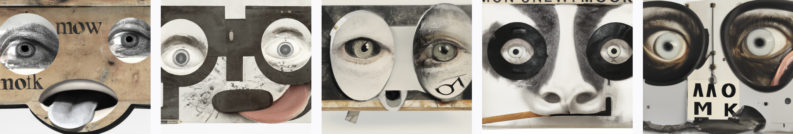
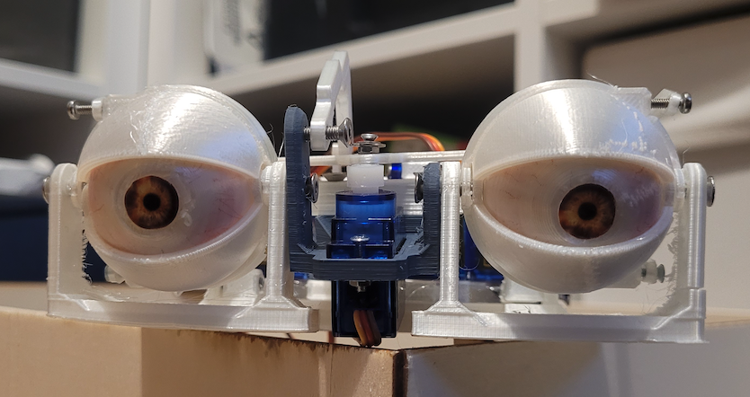

# eyeBox
Project documentation for the **Design for Physical Prototyping** course 2022/23 focusing on the topic of **Uncomfortable Devices**.

## Abstract

EyeBox was created as part of a lecture on uncomfortable interactions. The goal of the project was to design a machine that would be uncomfortable to interact with, and we settled on the idea of an "eating companion" that would watch the user while they eat. The idea behind this concept is that it can be uncomfortable to be watched while eating, and the machine would serve to amplify this discomfort. The project aims to create a real-time face tracking system using a webcam and servo motors. The system is able to detect a face in the webcam stream, extract the coordinates of the face, and send those coordinates to a microcontroller (ESP32) which converts them into the appropriate rotation for the servos. The servos are then able to move the eyes to look in the direction of the face, creating the illusion that the eyes are following the person in front of the webcam.

## Concept

This uncomfortable device is a *unique device* that aims to help individuals reduce food waste by providing an extrinsic motivation to finish their meals. It works by laying its gaze upon the user and thus watching them as they eat, judging each bite they take or don't take. The device will continue to watch the user until they have finished their meal, or until the machine sees fit. Once the user has finished eating or the machine has had enough, it will attempt to clean the plate and push any remaining food off of it. A successful outcome would be a clean plate and a *slight* feeling of discomfort, while an unsuccessful outcome would be no interaction with the user and a failed attempt at cleaning the plate. The device can be used with every meal, and is considered successful if the user finishes their plate. However, if the user neglects their plate and does not finish a meal due to a lack of *pressure or motivation* from the machine, it would be considered an unsuccessful outcome. The device may malfunction if it detects wrongful movements or the eyes and is not able to remove the plate and clean it.

It can be unpleasant due to its constant observation while eating, its twitching eyes or the noise it makes simply by existing. While it may provide solace for those seeking not to dine alone, it may very well be obnoxious for everyone else.

## Implementation

Decribed in simple terms, the project follows a pipeline in order to move the eyes. It is implemented using two code files, one written in C++ for the ESP32 and the other in Python for the PC. The C++ code runs on the ESP32 and sets up a WiFi server to receive data from the Python code. The Python code captures a webcam stream, uses OpenCV to detect a face, and sends the coordinates of the face to the ESP32 server. The ESP32 code receives the coordinates, maps them to the correct rotation for the servo motors, and then controls the servo motors to move the eyes to look in the direction of the face.

Code snippets and implementation steps can be found in their respective chapters on the subpages [Code](code) and [Implementation](implementation).

## Materials and tools

Materials and hardwate are listed below. The entire project was built from scratch save for electrical components. The casing for the eyes was built out of lasercut plywood and the eye-mech and the surrounding mechanics were 3D printed with PLA. As mentioned in the Implementation steps before, the eye-mech went through various iterations and 3D printing and lasercutting cardboard came in handy for fast protoyping of ideas. 

### Hardware:
**For eye-movement:**
- ESP32 Feather Board
- 4 Servo motors - SG90
- Servo Driver - PCA9685

**For Facetracking:**
- Webcam
- PC or laptop

**Additional:**
- Lasercutter
- 3D Printer
- Breadboard
- Wires
- Plywood
- PLA Filament

### Tools and Software:
- Python
- C++
- OpenCV library
- Haar cascade classifier
- PlatformIO for Visual Studio Code (instead of Arduino IDE)
- Adafruit_PWMServoDriver library
- Wi-Fi connection (supplied by a mobile hotspot from a Phone)

## Problems
During the development of the project, several problems that needed to be solved were  encountered. One of the main issues was controlling the servo motors. To find the correct oscillating frequency for the motors proved to be quite difficult and this in turn resulted in the servos not moving correctly. This problem required a significant amount of trial and error to solve, and it took a considerable amount of time to get the servos moving as desired.

Another problem was sending data from the Python code to the ESP32 over a server. The python script converts the integer array of coordinates into byte representation and sends it, but the ESP32 running with c++ receives the data differently, albeit still in byte representation. This required function to convert the byte representation back to the original integer array. This problem added an additional layer of complexity to the project and required a significant amount of debugging to solve.

In addition to the face tracking functionality, we also had the idea to add a cleaning function to the machine. The plan was to have a drawer at the bottom of the machine that would pull out a plate for the user to eat on, and once the user was finished, the plate would be pulled back into the machine for cleaning as the linear motion from moving backwards would be translated into rotary motion, spinning the plate. The bits left on the plate would then be pushed out of the machine. Sponges mounted on top of the drawer opening would clean the spinning plate. However, due to technical difficulties with the motor, power supply and gear transimission this functionality was not fully realized. Instead he plate can be pushed and pulled manually via the back of the box.

## Conclusion
Our project demonstrates the potential of using computer vision, microcontroller, and servo motors to create interactive and fun applications. The project uses the OpenCV library to detect a face in a webcam stream and extract the coordinates of the face. The coordinates are then converted into the appropriate rotation for the servo motors and controls the movement of the eyes, creating the illusion that the eyes are following the person in front of the webcam. This project shows that with simple tools, some debugging and modelling, electric skills, a high frustration levels and a lot of time it is possible to create uncomfortably interactive and unnervingly fun projects using open-source libraries and off-the-shelf hardware.

Overall, the project required a lot of troubleshooting and problem-solving in order to get the final working prototype. However, the team was able to overcome these difficulties and successfully implement the real-time face tracking functionality

*Addendum: also called iBox, eyeBox, iMech or eyeMech*
