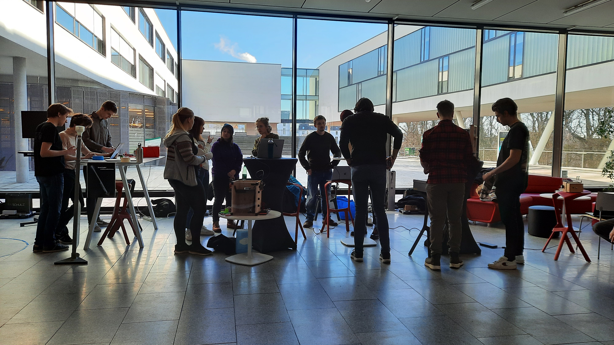

# Final presentations

Am 17.1.2023 fanden die Abschlusspräsentationen des Masterkurses Design for Physical Prototyping vom Studiengang Interactive Media erstmals in einem öffentlichen Rahmen statt, um auch die Aufmerksamkeit und Rückmeldungen von Außenstehenden zu gewinnen. Die ungewohnte Dynamik einer öffentlichen Demonstration der Projekte passte perfekt zum diesjährigen Thema des Kurses: Uncomfortable Devices oder auch Unbequeme Geräte. Da kommt gleich die Frage auf: Warum sollte eins sich abmühen Geräte zu bauen, welche Unbehagen hervorrufen?

Physical Prototyping ist der Prozess der materiellen Umsetzung einer Idee, das Bauen und Basteln als eine Form des Nachdenkens. Es ist die Verwendung unserer Hände als Erweiterung unseres Verstands. Das Ziel des Kurses ist neben der Vermittlung von praktischem Wissen, wie elektronischem Grundverständnis, Mikrocontroller-Programmierung und Materialbeschaffung, auch das Lernen von experimentellen und spielerischen Methoden zur Ideenfindung.

Das Thema Uncomfortable Devices stellt dabei die Annahme infrage, dass Technologie nur zum Nutzen der Menschen, die sie benutzen, entwickelt wird. Das Thema soll anregen, über den Sinn und Unsinn technologischer Lösungen nachzudenken. Darüber hinaus wird vermittelt, wie Unbehagen ganz bewusst als Teil von Interaktionsdesign eingesetzt werden kann, wie etwa am Beispiel von Achterbahnen, und welche ethischen Überlegen dabei zu beachten sind.

In unbequemen Maschinen steckt oft auch eine große Portion Humor. Die meisten der präsentierten Projekte sorgte für Lachen bei den BesucherInnen. Es wurde ein Wäschekorb präsentiert, der mit uns schimpft, weil wir unsere Wäsche zu wenig waschen. Ein anderes Team baute einen Mülleimer, welcher mittels Computervision, bei falscher Mülltrennung unseren Müll wieder zurückkatapultiert. Der Roboter "IBox" beobachtet die BenutzerInnen beim Essen und sorgt somit für Gesellschaft und Unbehagen. Ein weiteres Projekt beschäftigte sich mit Sparsamkeit: Ein Klopapierspender welcher die verwendbare Klopapiermenge auf ein Blatt limitiert. Das Team "BesAir" erfand den Besen neu und nahm mit ihrem Projekt Smart-Home-Geräte auf den Arm, welche mit ihren vielen Funktionen und einer notwendigen Internetverbindung mehr Probleme machen als sie lösen.

Zu Gast war bei der Präsentation auch die italienische Psychologin und PhD-Studentin Andrea Rezzani welche den Kurs mitgestaltete. Ihre Forschung im Human Technologies Lab an der Freien Universität Bozen beschäftigt sich mit dem Zusammenhang zwischen menschlicher Aggression und Technologie. Sie leitete einen Teil der Ideenfindung, bei der Interaktionen mit den Prototypen schauspielerisch demonstriert wurden.

Rückblickend war das Experiment, die Ergebnisse öffentlich zu präsentieren, ein Erfolg. Das Setting mit Unterhaltungscharakter motivierte die Studierenden eine interessante Präsentation vorzubereiten und ihren Projekten noch den letzten Feinschliff zu verleihen. Das Thema hat gezeigt, dass das Spielerische und Experimentelle ein wichtiger Bestandteil von Interaktionsdesign sein kann und dass Unbequemes nicht grundsätzlich schlecht sein muss, sondern uns zu neuen Perspektiven und Lösungen führen kann.

<figure><figcaption></figcaption></figure>
