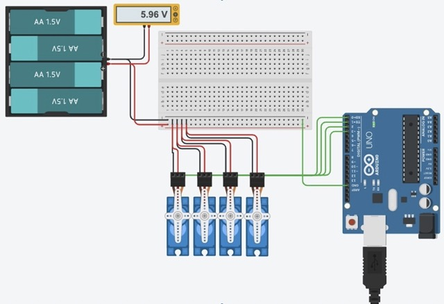
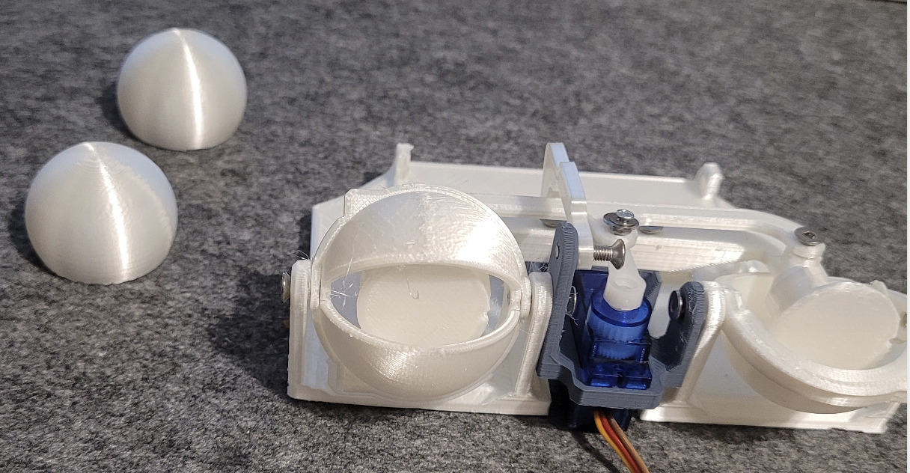
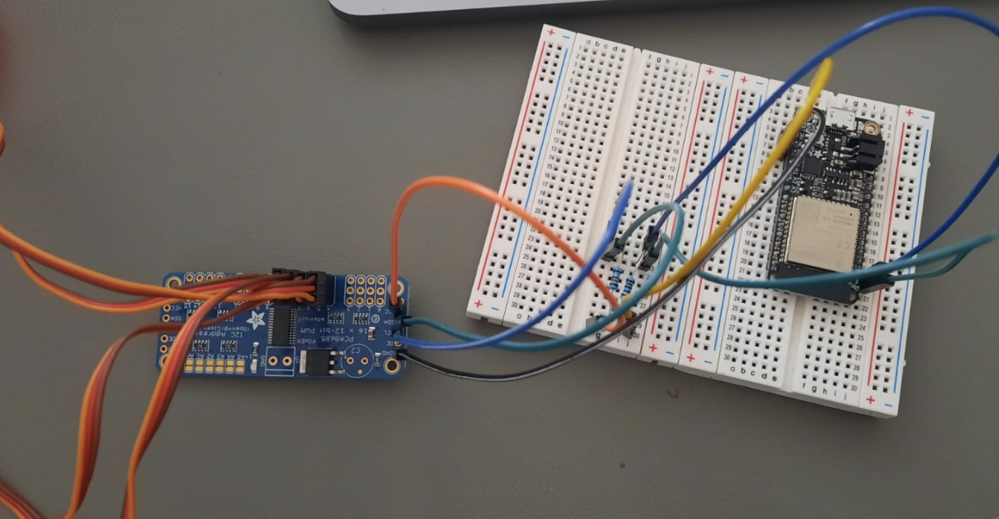
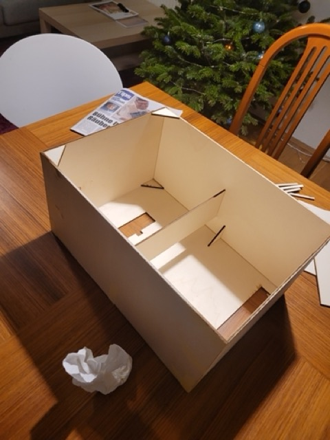
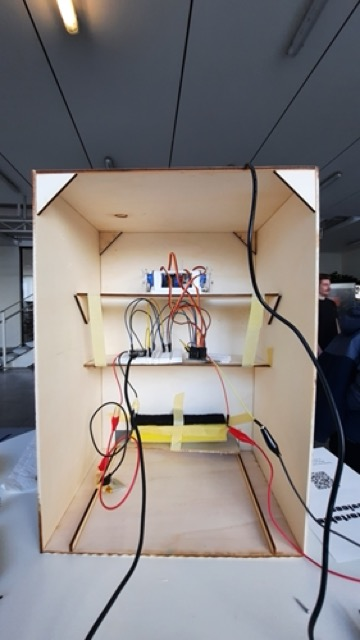
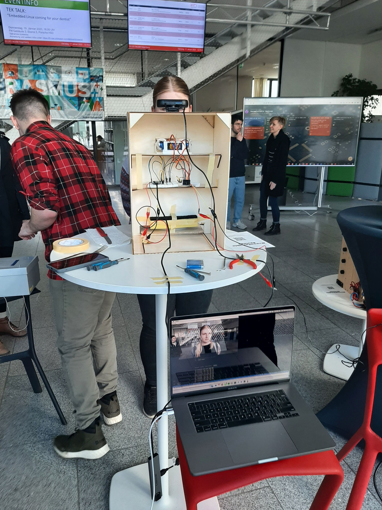

# Implementation

Eventough the steps were implemented in a *whatever-comes-up-will-be-dealt-with* and *i-have-time-for-this-now* order, the iterations describe the design and rough implementation process. 

## Table of Contents
- [Iteration 1](#iteration-1) - First tries
- [Iteration 2](#iteration-2) - Going remote
- [Iteration 3](#iteration-3) - Eyes, Assemble!
- [Iteration 4](#iteration-4---almost-final) - Final?
- [Final Iteration](#final-iteration) - Final!

## Iteration 1
**Hardware**

While simultaneously working on the face detection running in python the first prototype for the project were designed and built. Initially the entire pipeline should work on an arduino uno as this would have made it possible to incorporate all four servos without a servo driver. It became eveident very quickly that face detection would not run smooth on an arduino uno, thus other options had to be explored. While a rasberry pi would also be a viable option, a cross-device solution was chosen. 

**Facetracking**

Facetracking worked on single images and only if the user smiled in an exaggerated manner. Processing of one Face and printing the coordinates to the console took more than one second and the delay only added up. Different options have to be explored yet.

## Iteration 2
**Hardware**

The switch to the ESP32 feather board allowed for remote control of the servos which was tested with a small webpage hosted on the esp32 where the user could manually rotate the motor. Alongside this step, also a pca driver board was acquired to enable the control of up to 16 servos. Additionally, the design process for the mechanics began. A very crude one eyed version was 3D printed and the movement tested. The controls were really fragile and the eye cracked in the process of moving the upper lid with the servo. A more stable eye, lid and servo mount was needed.

**Facetracking**

Facetracking is more stable and can detect all Faces on a video stream in almost realtime. The time and coordinates were written to a file and the coordinates mapped from 0 to 180 degrees. In a simple script for the esp, with this data an 'animation' was reated to test the movement of the eye. The framerate was too quick and the motors could not react quick enough to big changes and just started quivering and breaking the joints of the eye. In order to allow for quicker exchange of parts, the eye was seprataed from the connector and can now be 'clicked' on a moint. In case of a joint break, only the joint has to be reprinted. 

## Iteration 3

**Facetracking**

The update rate was slowed down for sending data to the client. In the same python script a connection to a yet non-existant server was *theoretically* established and the detected face converted to x and y coordinates within the captured image.

**Hardware**

A first *durable* eye-mech was 3D printed and the servos attached as can be seen in the image below. This servo was still controlled by being directly attached to the esp32. The next step was connecting the PCA9865 driver board to the esp. This proved to be quite delicate as a correct assembly with resistors for the I2C connection was imperative. Once the PCA was connected, the next issue was testing out the correct frequencies and pulselengths in order to move the servos.

## Iteration 4 - *almost final*
Setting up and establishing a server connection between python on the PC and the esp32 was rather straightforward, what proved to be a nuisance was the data transmission. As the data was sent as an byte-encoded struct package from python, but C++ lacked the respective library, an intricat method with a self declared structure datatype had to be setup. With this obstacle out of the way, testing of the finally 3D printed and assembled eye-mech began. The face detection was done on a Mac with the built-in webcam.

The eyes were printed, painted, coated and mounted on the eye-mech. The eye-mech had been looking rather soulless so far. It goes without saying that the addition of eyes added not much soul either. The desired effect of eyes gazing at you and making you uncomfortable was reached, success. Additionally an encasing box was designed and lasercut out of plywood sheets. The box was glued together and the eyes and electronics installed.

## Final Iteration
For the presentation one aspect was changed which in turn set a waterfal of problems in motion. So far only the built in webcam was tested, for the presentation an external camera was used. Reading the data was no issue at all, the only problem occuring was that the raw image coordinates were flipped. Thus the mapping was calculating negative rotations which the servos could not handle. Troubleshooting and debugging this took quite some time. In the end, it worked out and visitors could appreciate **and** hate the eyeBox.

