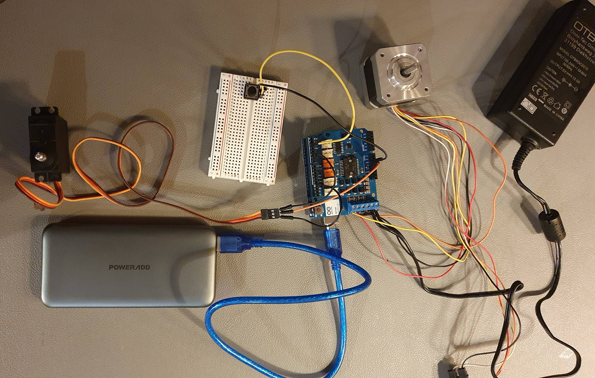

# Implementation of the bin

In the following, the implementation of the bin and the catapult are described. The goal of this was to have a housing into which the trash is thrown. Inside this, a catapult is placed, that either throws the trash back out or throws it into the bin.

## Iteration A

In a first prototype, pieces of cardboard were added together to get an overview of the needed parts and the size for the bin. It was soon realized that the cardboard will not be stable enough for the whole construction, especially not for the mechanical moving parts. Nevertheless, this first iteration gave a good overview which challenges to face during the further prototyping process.

In a first iteration, the electronic parts were also tested, and a basic software was set up. This included simulating the later waste detection with pressing a button on the breadboard. The button mechanism was later replaced by pins on the Raspberry Pi. For the stepper motor the library Accelstepper was used, the Bounce library was responsible for the Pin switches and reacting to them. For the servomotor, the basic Arduino Servo library was applied.

## Iteration B

In the second iteration, cardboard was used again, with some adaption. Especially as it is easier and faster to cut holes into it, than it is with wood, another version with cardboard was tried. The plan was that this way it would be easier to determine the correct position for the motors and the catapult on the housing.

To stabilize the new construction, additional cardboard was added on the inside of the bin. However, after cutting holes for the motors and the catapult, it was still not stable enough to use it properly for testing. Due to the interaction of many parts, everything had to fit very precisely into each other and not shift, which unfortunately could not be achieved with the cardboard. Sadly, no pictures were taken of this version.

## Iteration C

After the stabilized version with cardboard did not work out as well, left over wood was used for the base construction. As the catapult would only be mounted to two sides of the bin, the construction consists of a baseplate to which two parallel plates are attached. Another wood plate was cut to the width between the two parallel plates, to be used as the baseplate for the catapult.

To place the catapult-baseplate in the base construction, two holes were drilled into the two side plates at the same height. Then two holes were drilled into the sides of the catapult plate. Using two long screws, a little thinner than the drilled holes, the catapult plate was placed in the base construction. This way, the catapult can turn around this axis. The construction can be seen in the following image.

As can be seen in the image, the stepper motor was mounted to one of the side plates. To mount the spring onto the stepper motor, a special piece was 3d printed.

In the beginning, a piece of wood was used instead of the 3d printed part. To mount this onto the motor, a hole was drilled into the wood. However, no matter how small the hole was, it either did not fit onto the metal pin or it would turn on the pin.

Therefore, the 3d printed part has a hole that exactly fits the D-shape of the motor's metal pin, so that it would not turn in an unwanted manner.

To evaluate where the spring should be mounted onto the catapult plate, so that the plate could turn up and down in the wanted manner, a cord was used. This way it was possible to try out multiple different positions, by pulling on the cord, before drilling holes into the wood.

After screwing everything together and adding the electronics, the catapult was tested. This test lead to the conclusion, that the stepper motor was not able to pull the spring far enough, to throw something with the catapult.

## Iteration D

After studying the documentation of the motor, we tried another method of wiring, which allowed more torque to be achieved. After one or two tests, however, we realized that the chip on the motor shield was getting way too hot. After reading the documentation again, we noticed that the shield was not designed for the higher current with the new wiring, and so we had to find another solution for a higher torque of the motor. However, to be sure not to overheat the chip, we attached an external cooling element to the shield. With the cooling element, the chip could be kept cold much better and the danger of overheating even during longer operation could be minimized.

## Iteration E

As the stepper motor by itself was not strong enough to pull the spring as far as needed, without the motor shield overheating, the next idea was to use 3d printed gears to reduce the force the stepper motor has to generate. The used gears consist of two combined gears, one with double the radius of the other one.

By always combining a bigger gear with a smaller gear, as can be seen in the image above, the spring could be pulled further and further with every additional gear. When using four combined gears and a small gear on the stepper motor, it was possible to pull the spring far enough to throw things with the catapult. The overall gear ratio used for the final catapult version was 1:18. The motor itself was attached to the bottom of the trash bin. Since no standard mounting was provided there, a bracket was made with the 3D printer.

  &#x20;

Two problems that occurred during testing, were that the part and the gear the spring was mounted to would bend a lot due to the force produced by the spring. This resulted in the gear not matching with the next gear properly or the whole gear falling out of the hole it was mounted on. The other gears were also moving on the sticks they were mounted onto, which made the whole construction a bit unstable. To fix this issue spacer were printed, which fixed the distance between wood and gear and the spindles were printed again with more diameter and glued into the screwed hole in the final version. Additionally, the amount of gears was increased by one, so the force could be decreased further to make the whole construction more stable. The arm joining the catapult and the gears with the spring was reinforced by making it thicker and fixed with four pins on the first gear.

## Iteration F

The catapult board was first made of wood. But since we didn't have an exact saw and the weight of the wood put additional stress on the spring, we decided to make the board with the 3D printer. At the lateral axes of rotation and at the attachment of the spring, the board was reinforced and through a gyroid infill we gained additional stability. In order to fix the rotation axis, which consisted of M3 screws in the plate, nuts were melted into the 3d object with the help of a soldering iron, with which the screws could be fixed.

 

A bigger challenge was having to move the catapult plate in two directions. Since, it was supposed to throw out when the garbage was wrong and throw in when the garbage was right. As a first attempt, a plate was attached to the catapult plate, which should rotate in the same axis. When the spring is pulled up it should hold against it and when it is thrown in it should rotate downwards or return the catapult board to its original position. Unfortunately, the servo motor was not strong enough to generate the necessary counter-thrust while the spring was being raised, and the construction was generally very unstable with this solution.

As a further solution, 2 servo motors were considered, each of which should move a bracket. One of them should hold against the spring when it is tensioned, and one should release the lock when the trash falls down. While this solution was being built, it became apparent that it could also be achieved with the help of an offset attachment on the servo motor with only one motor. The picture shows the final attachment on the servo motor. To withstand the pressure while tensioning the spring, the upper arm was made thicker.

## Iteration G

The original plan was to use dark veneered wood and crafting glass for the final bin. By using crafting glass for the front and top of the bin, users would be able to see the inside of the bin with the gears, which looks quite interesting. The main reason for using the veneered wood was, that this wood was leftover wood and no extra costs would emerge for buying new wood.

However, when trying to cut the veneered wood, the cuts did not look great, as can be seen in the image below.

After trying a jigsaw and a circular saw, the only other option would have been to cut the wood by hand. Therefore, the decision was made to use other wood that could be cut better using the jigsaw. With that saw, it was a bit hard to cut exact straight lines, but in the end everything fit together better than expected.

With the measurements gained from the previous wood prototype and a true to scale drawing, the needed holes could be drilled and mortised.

&#x20;

Additionally, a new more stable part for mounting the spring to the gear, new pins for mounting the gears to the sides of the bin and small cylinders to prevent the gears from moving on these pins were 3d printed.

The crafting glass is mounted to the bin using 3D-printed brackets. To prevent trash from falling next to the catapult plate, another glass was attached to the top at a slight angle. This was not fixed with screws or glue to allow the emptying of the trash can.

 &#x20;

As a last step, brackets for the Arduino, the power supply and the Raspberry Pi were printed and attached to the back. To keep the cables as inconspicuous as possible, cable clips and cable ties were used.

To be able to point the camera at the trash without the risk of being hit by the catapult, a camera mount was attached to the side of the bucket. This consists of several joints to make it possible to adjust the camera even after screwing it on.

&#x20;&#x20;
