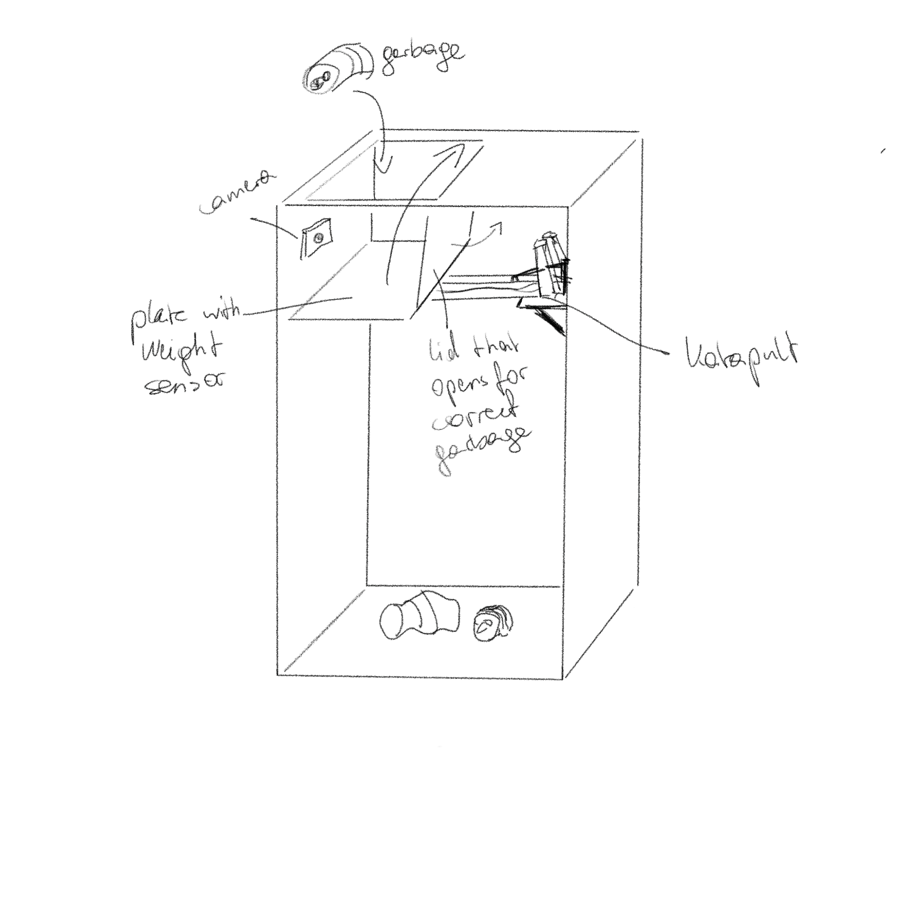

# Waste bin

Project documentation for the **Design for Physical Prototyping** course 2022/23 focusing on the topic of **Uncomfortable Devices**.

## Abstract

The idea of this project was to create a waste bin that can classify the waste that is thrown into it. If the waste belongs into the bin, it is taken, otherwise it is catapulted out of the bin, while the person that has thrown the item into the bin gets insulted. Several iterations were necessary to get to the final prototype, both for the waste recognition part and for the bin itself.

## Concept

The idea for this project was to create a waste bin, that throws trash that does not belong into the bin, back outside. Furthermore, the bin insults the person with audio output.
To throw the trash out, a catapult would be used. For the construction of the catapult, multiple references were found online. However, as it would not only have to catapult trash outside the bin, but also throw correct objects into the bin, these online references were used as a starting point. After sketching different versions of the catapult for the use case, the catapult in use was decided on.
The detection of wrong garbage was a bit more unclear. Multiple options were considered. The simplest being a wizard of oz prototype, where a person would check whether the object belongs into the bin or not and press a button to generate the correct action. Another simplified idea was to assign a color to each garbage class and use a color sensor to classify the garbage. The most advanced idea was to use machine learning to classify the garbage thrown into the bin.

The image below shows a first sketch of the waste bin.

## Implementation

A description of the implementation process can be found in the subchapters [Implementation Bin](https://annafhub.github.io/dpp_documentation/wastebin/implementation_bin.html) and [Implementation Waste Recognition](https://annafhub.github.io/dpp_documentation/wastebin/implementation_recognition.html). The first focuses on the implementation of the bin itself, while the second describes the process of creating the recognition part of the project.

The implementation was done by a group of 3 people, consiting of Anna Maschek, Lisa Lamplmair, Rita Hainzl. The tasks were splitted as following: 
- Lisa: 3D-printing, mechanical construction and drawing, Arduino Code and electronical setup
* Rita: python and raspberry code, image detection, waste recognition
+ Anna: mechanical construction, audio generation, woodworking

## Materials and tools

In the beginning, the plan was to use cardboard for the first prototypes. However, cardboard was not stable enough. Therefore, wood was used for the prototype's basic framework. The mechanical parts were mostly printed with PETG 3D-print filament in order to have stable enough parts. All cable clips and mounts for the hardware were also 3D-printed. For the control of the motors and the basic logic, an Arduino UNO with motor shield was utilized. For the image recognition with camera and the output of the audio, a Raspberry Pi with a script of the programming language python was chosen. All in all the waste bin contained 1 stepper motor, 1 servo motor, 8 gears, 7 ball bearing, 1 spring, 1 Arduino, 1 motor shield, 1 Raspberry Pi, 1 camera, 1 speaker, 1 powerbank, 1 power supply (5V) and various small components containing about 750g 3D-print Filament and screws.

## Conclusion

In the beginning we tried to work with cardboard to create a first prototype, however this was not stable enough, why we quickly moved on to using wood for the base construction. Without having expensive tools like a Circular saw, it is very difficult to get accurate enough wood pieces for a detailed project like the catapult. All parts had to fit together very well, so the opportunity to use the 3D-printer for the mechanical details was very helpful. After facing problems with using the stepper motor as it was too weak for the catapulting mechanism, gears were added to reduce the force necessary by the motor. The original mechanism for folding the catapult platform up and down had to be adapted as well, as it could not prevent the catapult platform from flipping up. The second iteration of that mechanism then worked very well. 
For the recognition of the waste, we could not manage to create an AI that would classify the waste with enough accuracy. Therefore, color detection was used to separate items into different groups. The color detection although worked really stable and the bin was able to sort properly.
