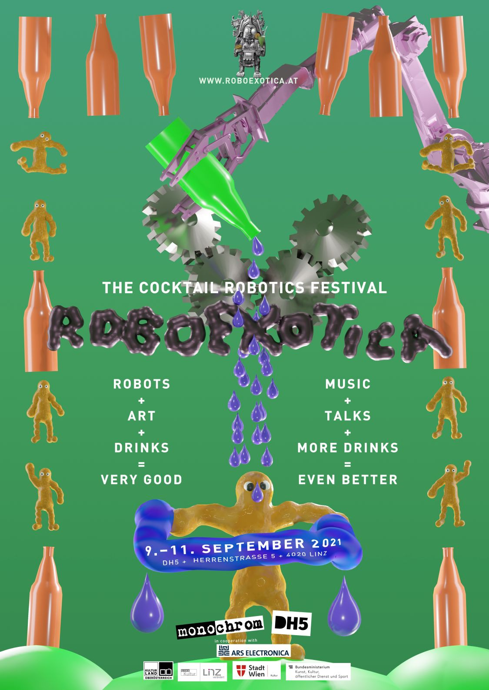

# Roboexotica 2021: Ars Electronica Edition

Das Media Interaction Lab der FH Hagenberg hat zusammen mit dem Kunstkollektiv monochrom und dem Kulturverein DH5 das etablierte Festival für Cocktailrobotik Roboexotica nach Linz geholt. Die dreitägige Veranstaltung bot über 600 Gästen, auch weit abseits des universitären Umfelds, einen niederschwelligen Zugang zum Thema Robotik. Angeregt durch die Zusammenarbeit im Projekt DigitalWerk, war das LIT Robopsychology Lab vor Ort, um die Anwendungsmöglichkeiten von Exoskeletten im Bar Umfeld auszuprobieren, über Exoskelette als Spezialform von Robotik zu informieren und mit den Gästen zu diskutieren.

### Panel Discussion

Als Teil der Roboexotica 2021 fand in den Räumen des HP23 eine Podiumsdiskussion statt. Des Event wurde von Dorf.tv aufgezeichnet und kann unter diesem [Link](https://dorftv.at/video/36187) auf der Website des Lokalsenders erneut angesehen werden.

Es diskutierten [Mitch Altmann](https://en.wikipedia.org/wiki/Mitch\_Altman), [Katrin Hunze](https://raumperspektive.com/) und [Bruno Buchberger](https://en.wikipedia.org/wiki/Bruno\_Buchberger). Die Diskussion moderiert [Johannes Grenzfurthner](https://en.wikipedia.org/wiki/Johannes\_Grenzfurthner).

<figure><figcaption>
Bruno Buchberger beschreibt sein Verständnis von Fortschritt und Technologie.
</figcaption></figure>

<figure><figcaption></figcaption></figure>
